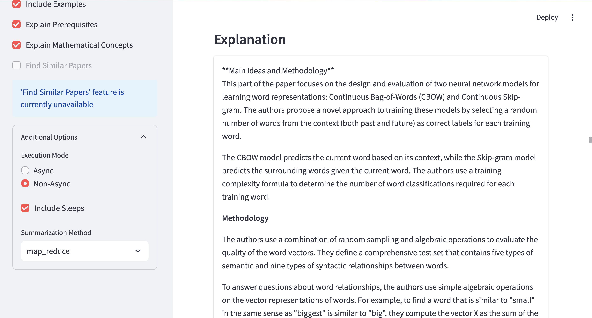

# AI-Research-Paper-Explainer 📚🔬

[](https://www.python.org/downloads/)
[](https://streamlit.io/)
[](https://python.langchain.com/)
[](https://opensource.org/licenses/MIT)

AI-Research-Paper-Explainer transforms complex research papers into clear, digestible explanations using advanced Large Language Models (LLMs).

## 🌟 Features

- 📄 PDF Upload
- 🧠 Multi-LLM Support (GPT-4, Claude, Gemini, and more)
- 🎓 Adaptive Explanations (High School to Expert level)
- 🔍 Comprehensive Insights (Main ideas, examples, prerequisites, math concepts)
- ⚡ Efficient Processing
- 🖥️ Intuitive Streamlit Interface

## 🚀 Quick Start

1. Clone the repository:
   ```
   git clone https://github.com/rd-serendipity/ai-research-paper-explainer.git
   cd ai-research-paper-explainer
   ```

2. Set up and activate a virtual environment:
   ```
   python -m venv venv
   source venv/bin/activate  # On Windows, use `venv\Scripts\activate`
   ```

3. Install dependencies:
   ```
   pip install -r requirements.txt
   ```

4. Set up environment variables:
   ```
   cp .env.example .env
   ```
   Edit `.env` and add your LLM API keys.

5. Run the app:
   ```
   streamlit run src/app.py
   ```

6. Open `http://localhost:8501` in your browser.

## 📸 Screenshots

### Initial UI with Paper Summary

*The starting page of the UI, showing a summary of the uploaded paper.*

### Chunk Display

*Display of a specific chunk from the paper.*

### Prerequisites Explanation

*Explanation of prerequisites for understanding the current chunk.*

### Content Explanation

*Detailed explanation of the content within the chunk.*

### Mathematical Concepts

*Breakdown of mathematical concepts present in the chunk.*

### Examples

*Practical examples related to the concepts in the chunk.*

## 🔮 Future Developments

- Find and summarize related papers
- Improved prompt engineering
- Enhanced visualizations
- User feedback integration

## 🤝 Contributing

We welcome contributions! See our [CONTRIBUTING.md](CONTRIBUTING.md) for guidelines on how to get involved.

## 📄 License

This project is licensed under the MIT License - see the [LICENSE](LICENSE) file for details.

---

⭐️ If you find this project useful, please consider giving it a star on GitHub!

[Report Bug](https://github.com/rd-serendipity/ai-research-paper-explainer/issues) •
[Request Feature](https://github.com/rd-serendipity/ai-research-paper-explainer/issues)
