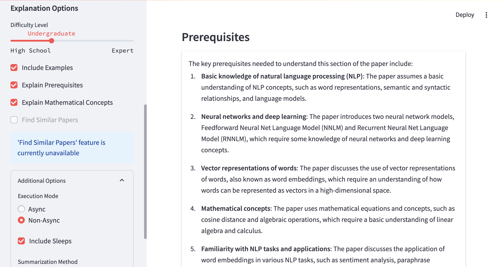

# AI-Research-Paper-Explainer 📚🔬

[](https://www.python.org/downloads/)
[](https://streamlit.io/)
[](https://python.langchain.com/)
[](https://opensource.org/licenses/MIT)

AI-Research-Paper-Explainer transforms complex research papers into clear, digestible explanations using advanced Large Language Models (LLMs).

## 🌟 Features

- 📄 PDF Upload: Upload and process research papers in PDF format.
- 🧠 Multi-LLM Support: Choose from a wide range of LLMs including:
  - OpenAI models (GPT-4, GPT-3.5-turbo)
  - Anthropic models (Claude-3 Opus, Sonnet, Haiku)
  - Google models (Gemini Pro, Gemini 1.5 Pro, Gemini 1.5 Flash)
  - Groq models (Mixtral, LLaMA variants)
  - Mistral AI models
- 🎓 Adaptive Explanations: Tailor explanations from High School to Expert level.
- 🔍 Comprehensive Insights:
  - Main ideas and methodology
  - Concrete examples
  - Prerequisites
  - Mathematical concepts
- ⚡ Efficient Processing:
  - Async mode for faster processing (with compatible LLMs)
  - Non-async mode with optional sleep for rate-limited APIs
- 🖥️ Intuitive Streamlit Interface
- 📊 Flexible Summarization: Choose between map-reduce, refine, or stuff methods
- 🔄 Customizable Execution:
  - Async/Non-async processing
  - Sleep option for rate limiting (useful for free-tier API usage)

## 📸 Screenshots

### Initial UI with Paper Summary

*The starting page of the UI, showing a summary of the uploaded paper.*

### Chunk Display

*Display of a specific chunk from the paper.*

### Prerequisites Explanation

*Explanation of prerequisites for understanding the current chunk.*

### Content Explanation

*Detailed explanation of the content within the chunk.*

### Mathematical Concepts

*Breakdown of mathematical concepts present in the chunk.*

### Examples

*Practical examples related to the concepts in the chunk.*

## 🚀 Quick Start

1. Clone the repository:
   ```
   git clone https://github.com/rd-serendipity/ai-research-paper-explainer.git
   cd ai-research-paper-explainer
   ```

2. Set up and activate a virtual environment:
   ```
   python -m venv venv
   source venv/bin/activate  # On Windows, use `venv\Scripts\activate`
   ```

3. Install dependencies:
   ```
   pip install -r requirements.txt
   ```

4. Set up environment variables:
   ```
   cp .env.example .env
   ```
   Edit `.env` and add your LLM API keys.

5. Run the app:
   ```
   streamlit run src/app.py
   ```

6. Open `http://localhost:8501` in your browser.


## 📊 Using the Explainer

1. **Upload Your Paper**: Use the sidebar to upload a PDF of the research paper.

2. **Choose Your LLM**: Select from a variety of LLM providers and models.

3. **Configure Explanation Options**:
   - Set the difficulty level (High School to Expert)
   - Choose to include examples, prerequisites, and mathematical explanations
   - (Future feature) Option to find and summarize similar papers

4. **Advanced Settings**:
   - **Execution Mode**: 
     - Async: Faster processing, ideal for paid API tiers
     - Non-Async: Suitable for free API tiers or rate-limited usage
   - **Sleep Option**: When using Non-Async mode, enable this to add pauses between API calls (helps with rate limits)
   - **Summarization Method**: Choose between map_reduce, refine, or stuff algorithms

5. **Process the Paper**: Click "Process Paper" to start the explanation generation.

6. **Review Results**: The app will display:
   - A summary of the entire paper
   - Chunk-by-chunk breakdowns including:
     - Original text
     - Prerequisites (if selected)
     - Detailed explanation
     - Examples (if selected)
     - Mathematical concepts (if selected and present in the chunk)

## 💡 Tips for Usage

- **Free Tier Users**: If you're using free tier APIs (e.g., Groq or Gemini):
  - Select "Non-Async" execution mode
  - Enable the "Include Sleeps" option in Additional Settings
  - This will add pauses between API calls to help manage rate limits
- **Paid Tier Users**: For faster processing, use the "Async" execution mode.
- **Difficulty Level**: Adjust based on your target audience or personal understanding.
- **Summarization Method**:
  - `map_reduce`: Good for longer papers, summarizes in parts then combines
  - `refine`: Iteratively refines the summary, good for nuanced papers
  - `stuff`: Best for shorter papers, processes all text at once

## 🔮 Future Developments

- Find and summarize related papers
- Improved prompt engineering
- Enhanced visualizations
- User feedback integration

## 🤝 Contributing

We welcome contributions! See our [CONTRIBUTING.md](CONTRIBUTING.md) for guidelines on how to get involved.

## 📄 License

This project is licensed under the MIT License - see the [LICENSE](LICENSE) file for details.

---

⭐️ If you find this project useful, please consider giving it a star on GitHub!

[Report Bug](https://github.com/rd-serendipity/ai-research-paper-explainer/issues) •
[Request Feature](https://github.com/rd-serendipity/ai-research-paper-explainer/issues)
